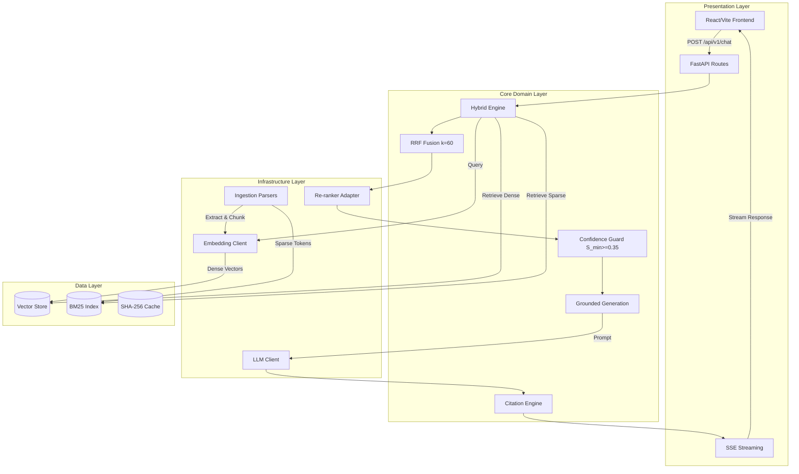

# System Architecture Specification

**Status:** Draft | **Version:** 0.1.0 | **Scope:** Corporate Document Assistant ("Chat with Your Doc")

## 1. System Topology & Data Flow



## 2. Layer Architecture & Boundaries
*   **Presentation Layer**: React 18+/Vite frontend, FastAPI route handlers, SSE streaming endpoints (`/api/v1/chat`, `/api/v1/debug/retrieval`). Handles HTTP routing, streaming, and UI representation.
*   **Core Domain Layer**: Hybrid retrieval engine, RRF fusion logic, grounding mechanisms, citation extraction, and confidence guard gating. Contains pure business logic.
*   **Infrastructure Layer**: LLM client (OpenAI), embedding clients, re-ranker adapters (FlashRank/Cohere), and ingestion parsers (PDF, DOCX, Markdown). Handles all external I/O.
*   **Data Layer**: Qdrant/pgvector vector store, BM25 index, SHA-256 cache store, and evaluation datasets. Manages persistence and state.

## 3. Architecture Enforcement Rules
1.  **Layered Dependency Flow**: Strictly top-down (Presentation → Core → Infrastructure → Data). Inner layers must not depend on outer layers.
2.  **Exception Shielding**: Custom `AppBaseError` hierarchy. Infrastructure/I/O errors must be caught and mapped to domain exceptions before reaching Presentation.
3.  **Deterministic Data Contracts**: Strictly Pydantic V2 `frozen=True` models. No mutable state, raw dictionaries, or implicit typings allowed at layer boundaries.
4.  **FinOps Observability**: Mandatory tracking of prompt tokens, completion tokens, execution time, and estimated USD costs per request.
5.  **Pure Logic & Side-Effect Isolation**: Retrieval and grounding logic must be pure functions. Network and file I/O must be strictly isolated to infrastructure adapters.
6.  **Guardrails & Security**: Implement prompt injection filtering, PII masking, and strict secret management via `pydantic-settings` (`BaseSettings`).
7.  **Anti-Hallucination Enforcement**: Strict confidence threshold (`S_min >= 0.35`), mandatory citation validation, and fallback to "I don't know" if context is insufficient. Context-only generation enforced.

## 4. Core Data Schemas & Contracts

```python
from pydantic import BaseModel, Field
from typing import List

class ChunkMetadata(BaseModel, frozen=True):
    source_format: str
    chunk_index: int
    total_chunks: int
    char_count: int
    token_count: int

class ChunkDocument(BaseModel, frozen=True):
    chunk_id: str
    text: str
    file_name: str
    page_number: int
    metadata: ChunkMetadata

class RetrievalResult(BaseModel, frozen=True):
    chunk_id: str
    text: str
    file_name: str
    page_number: int
    relevance_score: float
    retrieval_method: str

class ChatRequest(BaseModel, frozen=True):
    query: str
    conversation_id: str
    top_k: int = 5

class Citation(BaseModel, frozen=True):
    file_name: str
    page_number: int
    chunk_id: str
    excerpt: str
    relevance_score: float

class FinOpsMetadata(BaseModel, frozen=True):
    prompt_tokens: int
    completion_tokens: int
    total_tokens: int
    estimated_cost_usd: float
    execution_time_seconds: float
    is_cached: bool

class ChatResponse(BaseModel, frozen=True):
    answer: str
    citations: List[Citation]
    confidence_score: float
    grounded: bool
    latency_ms: int
    finops: FinOpsMetadata

class DebugRetrievalResponse(BaseModel, frozen=True):
    query: str
    dense_hits: List[RetrievalResult]
    sparse_hits: List[RetrievalResult]
    rrf_fused: List[RetrievalResult]
    final_reranked: List[RetrievalResult]
```

## 5. Production Codebase Layout

```text
src/
├── api/               # Presentation: FastAPI routes, SSE, auth
├── retrieval/         # Core Domain: hybrid engine, RRF, reranker
├── generation/        # Core Domain: grounding, prompts, citations
├── ingestion/         # Infrastructure: parsers, recursive splitters
├── clients/           # Infrastructure: LLM, embedding, reranker adapters
├── models/            # Shared: Pydantic V2 frozen schemas
├── core/              # Shared: config, exceptions, telemetry
└── cache/             # Data: SHA-256 cache persistence
frontend/              # Presentation: React 18+ / Vite / TypeScript
```

## 6. Vector Store & RAG Architecture
*   **Chunking Strategy**: Recursive structural splitting (max 512 tokens, 10% overlap).
*   **Dense Index**: Qdrant (COSINE similarity, dim=1536) or pgvector.
*   **Sparse Index**: BM25Okapi tokenized corpus or Qdrant sparse vectors.
*   **Hybrid Fusion**: Reciprocal Rank Fusion (RRF, `k=60`). Retrieves top 50 from both dense and sparse paths prior to fusion.
*   **Re-ranking**: FlashRank (local CPU) using `ms-marco-MiniLM-L-6-v2`. Fallback to Cohere Rerank API. Reduces top 30 fused chunks to top 5 final contexts.
*   **Confidence Gate**: Minimum acceptable relevance score `S_min >= 0.35`. Queries below threshold yield controlled fallback responses.

## 7. Resilience & Caching
*   **Retry Mechanism**: `Tenacity` library utilizing exponential backoff and jitter for 429/5xx HTTP errors (maximum 4 retries).
*   **Caching Strategy**: SHA-256 hashing of queries for exact-match retrieval caching to reduce API spend and latency.
*   **Circuit Breakers**: Implemented for external LLM and Embedding API endpoints to prevent cascading system failures.

## 8. Tech Stack Matrix

| Component       | Tool                        | Requirement                                 |
| --------------- | --------------------------- | ------------------------------------------- |
| Backend         | Python 3.11+, FastAPI       | High performance ASGI, async, strict typing |
| Verification    | Mypy strict, Ruff           | Code quality, strict static analysis        |
| Validation      | Pydantic V2                 | `frozen=True` DTOs, fast core serialization |
| Vector Store    | Qdrant / pgvector           | High-throughput dense vector search         |
| Lexical Engine  | rank-bm25 / Qdrant Sparse   | Keyword matching for hybrid retrieval       |
| Re-Ranker       | FlashRank / Cohere          | High precision cross-encoder context ranking|
| Frontend        | React 18+, Vite, TypeScript | Modern, typesafe component architecture     |
| Containerization| Docker & docker-compose     | API, Vector Store, Web Client isolation     |
| Dependency Mgt  | Poetry                      | Deterministic builds and locking            |

## 9. Technical Risks & Mitigations

| Risk | Mitigation Strategy |
| :--- | :--- |
| **Embedding Drift** | Versioned embedding models; trigger automated re-indexing on version changes. |
| **Re-ranker Latency** | Local CPU FlashRank optimization; strict timeout configurations and timeouts. |
| **Hallucination Leakage** | Grounded generation constraints; confidence gate (`S_min`); rigorous eval testing. |
| **Vector Store Scaling** | Efficient chunking; hardware provisioning guidelines; background indexing offload. |
| **Citation Extract Failure**| Strict LLM structured output parsing; regex fallback mechanisms. |
| **Prompt Injection Attacks**| Input sanitation; system prompt hardening; PII masking pre-flight filters. |

## 10. Design Trade-offs & Decisions (ADRs)
*   **Qdrant vs pgvector**: Qdrant is preferred for out-of-the-box sparse/dense hybrid support and memory efficiency. pgvector remains an alternative if standard PostgreSQL infrastructure is strictly mandated.
*   **FlashRank local vs Cohere API**: Local FlashRank selected to minimize latency per request and eliminate external re-ranker API costs. Cohere is reserved strictly as a high-availability fallback.
*   **Streaming SSE vs WebSocket**: SSE selected for unidirectional text streaming (LLM response generation) due to simpler load balancing requirements and native HTTP compatibility.
*   **BM25 in-memory vs external**: In-memory `rank-bm25` is viable for the initial scale (5,000 pages). The architecture dictates migration to Qdrant sparse vectors if the document corpus scales significantly beyond requirements.

## 11. Quality Benchmark Targets

| Metric | Threshold | Method |
| :--- | :--- | :--- |
| `retrieval_precision@5` | ≥ 0.75 | Ground-truth label match ratio |
| `citation_accuracy` | = 1.00 | Cited metadata vs retrieved chunk validation |
| `hallucination_rate` | ≤ 0.05 | LLM-as-a-Judge unsupported claim detection |
| `faithfulness_score` | ≥ 0.85 | RAGAS context-to-answer alignment |
| `honesty_filter_precision` | ≥ 0.90 | Correct refusal on out-of-corpus queries |
| `p95_latency_ms` | ≤ 3000 | End-to-end pipeline timing |
| `test_coverage` | ≥ 80% | pytest line coverage |
